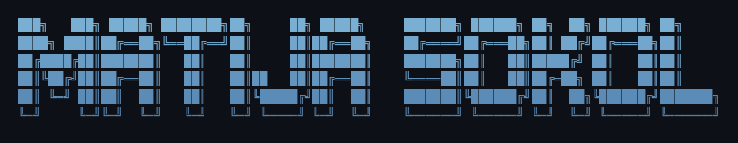
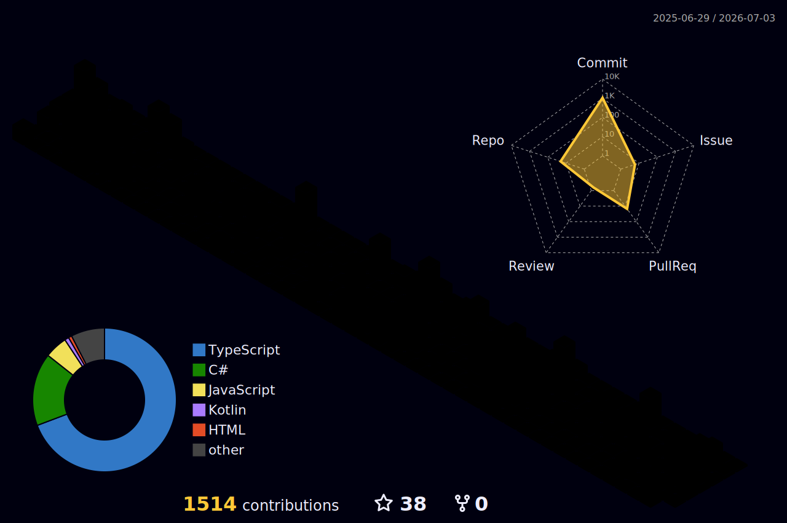

# Hi there! I'm

<h2 align="center">Tech Stack</h2>

`TanStack Start/Router` `shadcn/ui` `Zustand` `Zod` `Streamlit` `Pandas` `Plotly` `Claude Code` `MCP` `SQL Server` `Tailscale`

<h2 align="center">Current Favorite Stack</h2>

<h2 align="center">GitHub Stats</h2>

<h2 align="center">Claude AI Usage</h2>

<h2 align="center">Connect</h2>

