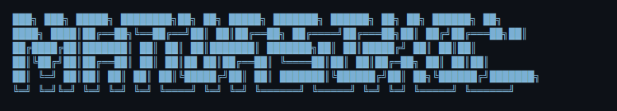

<div align="center">
  
# Hi there! I'm 
[](https://git.io/typing-svg)



</div>

<div align="center">

<h2 align="center">About Me</h2>

</div>

```typescript
const matija = {
    age: 29,
    location: "Zagreb, Croatia",
    company: "TomiPharm d.o.o. + HP Poreč (Freelance)",
    role: "Full-Stack Developer | IT Specialist (4+ years)",
    education: "BSc Software Engineering @ Algebra University (Final Year)",
    currentFocus: ["Hotel PMS", "Enterprise ERP", "AI tooling"],
    passions: ["Clean architecture", "End-to-end ownership", "Rapid prototyping"],
    askMeAbout: [".NET", "React", "TypeScript", "Supabase", "System design"],
    currentlyLearning: ["TanStack Start", "Grafana/Prometheus", "Advanced DevOps"],
    openToCollaborate: true
};
```

<h2 align="center">Professional Experience</h2>

**TomiPharm d.o.o.** — *IT Specialist | Full-Stack Developer* (2022 – Present)

Architected an enterprise ERP for a pharmaceutical wholesaler — inventory, ordering, returns, debts, Croatian e-invoicing with digital signing, OCR invoice import pipeline, IQVIA market-analytics module, and a multi-page BI platform over 10+ years of sales data.

**HP Poreč — Hotel Property Management System** — *Freelance Full-Stack Developer* (Jul 2025 – Present)

Built a production hotel PMS from scratch — multi-day drag-and-drop reservation timeline, Croatian fiscal compliance with digitally signed invoices, NFC room-cleaning tags, cron automation, multi-language guest comms, and a power-user keyboard-shortcut layer.

<div align="center">


</div>

---

<h2 align="center">Tech Stack</h2>

<div align="center">


`TanStack Start/Router` `shadcn/ui` `Zustand` `Zod` `Streamlit` `Pandas` `Plotly` `Claude Code` `MCP` `SQL Server` `Tailscale`

</div>

<h2 align="center">Current Favorite Stack</h2>

<div align="center">


</div>

---


---

<h2 align="center">Featured Projects</h2>

<h3 align="center">Pokemon Cards CSS — Holographic Effects</h3>

**Viral CSS project featured on CSS-Tricks**

**Stack:** Svelte · CSS3 · Advanced Animations  
**Highlights:** 1.8k+ GitHub stars · Featured on CSS-Tricks & CodePen · Realistic holographic card effects using pure CSS transforms  
[Live Demo](https://poke-holo.simey.me/) | [CSS-Tricks Article](https://css-tricks.com/holographic-trading-card-effect/)

---

<h3 align="center">Open-Source CLI Scaffolder — Published on npm</h3>

Interactive CLI scaffolding production-ready full-stack SaaS apps in a single command — auth, payments, transactional email, CI/CD pipelines, and integrated AI-tooling configuration.

---

<h3 align="center">HP Poreč — Hotel Property Management System</h3>

Production hotel PMS built from the ground up. Multi-day drag-and-drop timeline, Croatian fiscal compliance, NFC tags, cron automation, mobile push notifications.

**Stack:** React · TanStack Start/Router · Supabase · Tailwind · TypeScript

---

<table>
<tr>
<td width="50%">

<h3 align="center">TomiPharm Integration System</h3>

Enterprise pharmaceutical wholesale ERP. End-to-end design across inventory, ordering, returns, debts, and Croatian e-invoicing with digital signing.

**Stack:** .NET · ASP.NET · SQL Server · T-SQL · REST

</td>
<td width="50%">

<h3 align="center">HP-Duga Pharmacy System</h3>

Full-stack pharmacy management with Croatian FINA e-invoice compliance. Multi-pharmacy inventory, real-time order management, enterprise integrations.

**Stack:** React · TypeScript · Supabase · SOAP · XML/UBL

</td>
</tr>
</table>

<h3 align="center">Multiplatform TTS Ecosystem</h3>

Self-hosted TTS spanning a browser extension and Android companion app with on-device camera OCR, both connecting to a personal TTS server over Tailscale.

**Stack:** Kotlin · JavaScript · Tailscale

<h3 align="center">Gene Expression Analyzer — Live deployment</h3>

Automated ETL pipeline scraping cancer-genomics data from a public research portal, processing large biomedical datasets, and visualizing in an interactive analytics dashboard.

**Stack:** Python · Streamlit · Pandas · Plotly

---

<h2 align="center">GitHub Stats</h2>

<div align="center">


[](https://git.io/streak-stats)


[](https://github.com/ashutosh00710/github-readme-activity-graph)


</div>

---

<!--START_SECTION:activity-->
<!--END_SECTION:activity-->

<!--START_SECTION:waka-->
<!--END_SECTION:waka-->

---

<h3 align="center">Claude AI Usage (via Tokscale)</h3>

<div align="center">

[](https://tokscale.ai/u/sokol-matija)

</div>

---

<div align="center">


</div>

<h2 align="center">Connect</h2>

<div align="center">

[](https://www.linkedin.com/in/matija-sokol-0b29ba1b3/)
[](mailto:sokol.matija@gmail.com)
[](https://open.spotify.com/user/66o5u6b7amuxtv9kbabma2fsr)
[](https://discordapp.com/users/zerocool247)

---

⭐️ From [sokol-matija](https://github.com/sokol-matija)

</div>
